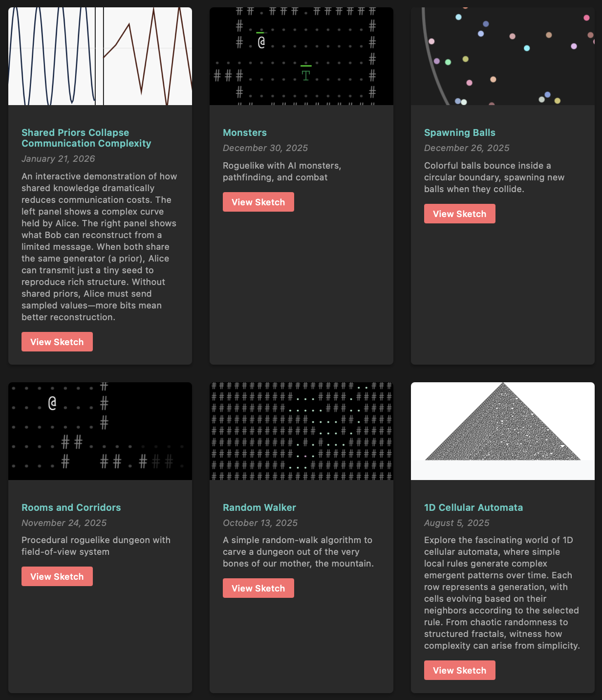

# P5.js Sketches

Interactive experiments in emergence, learning, and procedural generation.

**[Enter the gallery →](https://bitterbridge.github.io/p5js-sketches/)**

---

### Featured

**Robbie the Robot** — Watch robots evolve via genetic algorithm to collect cans. Simple genomes, emergent intelligence.

**1D Cellular Automata** — 256 rules, infinite patterns. Complexity from nothing but neighbors.

**Shared Priors** — Information theory made visible. See how shared knowledge collapses communication costs from many bits to nearly zero.

**Rooms & Corridors** — Procedural dungeons with real-time field-of-view. Shadowcasting, raycasting, and more.

**Monsters** — A playable roguelike. Pathfinding AI, turn-based combat, and permadeath in your browser.

**Linear Regression** — Gradient descent, animated. Watch a line learn.

---

Released under the [Unlicense](./LICENSE). Do whatever you want with any of this.

*Built with [Hugo](https://gohugo.io/) and [p5.js](https://p5js.org/)*
